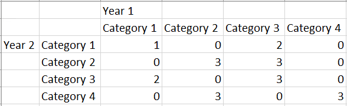
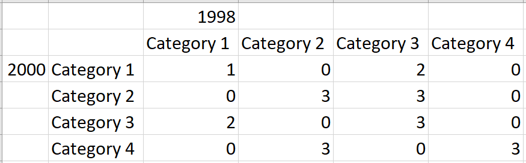
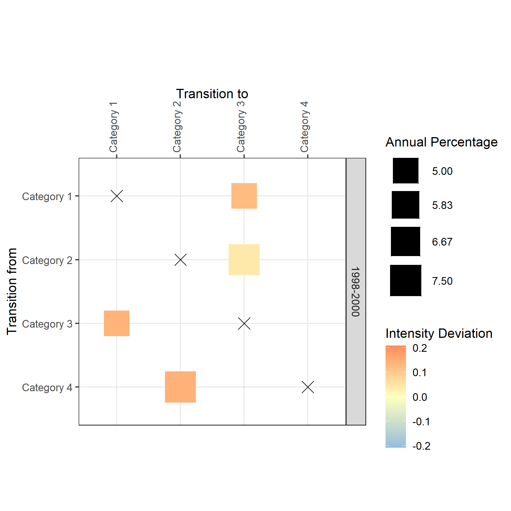
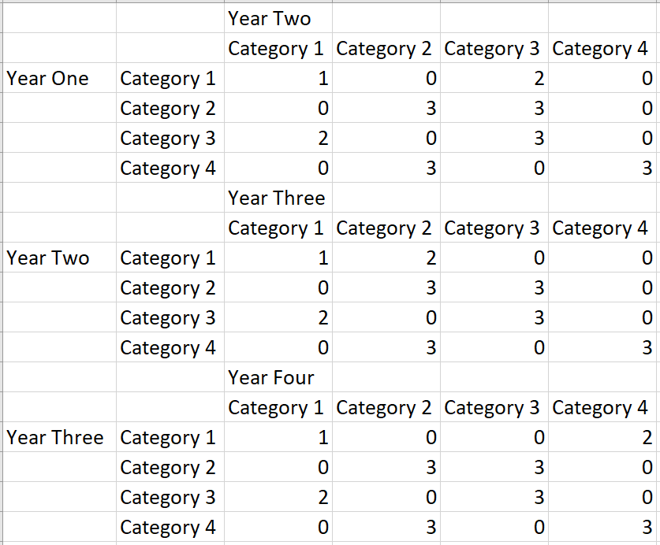

# Transition Matrix

A R Package for Analyzing Change in a Cross-Tab Matrix Display of transition matrices using GGPLOT where size of square indicates size of transition and color shows targeting or avoiding. This plot allows users to visualize both the size and intensity of land transitions while considering possible map errors.

# Input Data
The input is a .csv file with land-cover information:  

The .csv should match the specific format as displayed above.

# Example Usage
#### Example Input Data

#### Example Output Plot

## Work With Multiple Time Intervals

Addtional tables should be copied and pasted directly below prior table without any spaces in between.
Years specified for each table are consistent and contiguous (i.e chart 1 ends 2000; chart 2 starts 2000).
Number of Categories is same for each table in the series, and category labels are the same for X & Y in each chart and across all charts.
Extent is the same for tables in the series.

### Further Information & Contact
- **Library Information:**  
Tom Francis, tofrancis@clarku.edu    
Samuel Wen, xiwen@clarku.edu
   

- **Metric Methodolgy:**  
Robert (Gil) Pontius, rpontius@clarku.edu  

### References
_Xie, Z.; Pontius Jr, R.G.; Huang, J.; Nitivattananon, V. Enhanced Intensity Analysis to Quantify Categorical Change and to Identify Suspicious Land Transitions: A Case Study of Nanchang, China. Remote Sens. 2020, 12, 3323. https://doi.org/10.3390/rs12203323_  